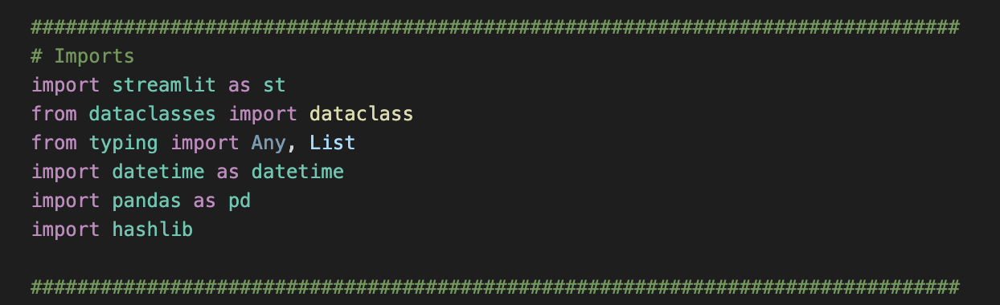

# Blockchain_with_Python

The purpose of this challenge was to create a blockchain ledger capable of recording transaction information, as well as confirming the validity of the data within the ledger. This was accomplished using the streamlit library to create a web interface for our ledger. To launch the web interface simply navigate to the folder containing the python file using terminal, and enter the command "streamlit run pychain.py"

In order to create the ledger, the following libraries and dependencies were required: 

Once the ledger is launched the top of the page will display an area to input the transaction data, including the sender, receiver, and amount; as the following image shows.

After the data is entered and the "Add Block" button is clicked, the transaction is added to the ledger. The following image shows how the ledger appears after multiple transactions are recorded. 

The ledger also contains a Block Inspector feature, which allows the user to view a specific block in the ledger, and the information relating to that transaction. Just select a block from the dropdown menu and a record like the following image will appear. 

Additionally, to ensure the validity of the ledger, one can click the "Validate Chain" button, and if the integrity of the blockchain is confirmed, the ledger will show "True."
